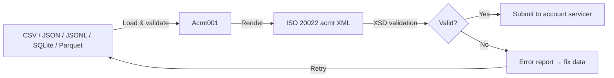

# Acmt001: Automate ISO 20022-Compliant Account Management File Creation

![Acmt001 banner][banner]

[![PyPI Version][pypi-badge]][07]
[![Python Versions][python-versions-badge]][07]
[![PyPI Downloads][pypi-downloads-badge]][07]
[![Licence][licence-badge]][01]
[![Codecov][codecov-badge]][06]
[![Tests][tests-badge]][tests-url]
[![Quality][quality-badge]][quality-url]
[![Documentation][docs-badge]][docs-url]

**Enterprise-grade ISO 20022 account-management message generation** — open,
maintain, close, switch, and verify bank accounts from plain data files.

> **Latest release: v0.0.1** — 34 ISO 20022 `acmt` message types, IBAN/BIC/LEI
> validation, charset compliance, a Click CLI, and a FastAPI REST API.
> [See what's new →][release-001]

## Contents

- [Overview](#overview)
- [Install](#install)
- [Quick Start](#quick-start)
  - [Dry-run validation](#dry-run-validation)
  - [Arguments](#arguments)
- [Features](#features)
- [Supported Messages](#supported-messages)
- [Input Data Format](#input-data-format)
- [Library Usage](#library-usage)
- [Examples](#examples)
- [REST API & Developer Portal](#rest-api--developer-portal)
- [MCP Server](#mcp-server)
- [Language Server (LSP)](#language-server-lsp)
- [Validation](#validation)
- [Compliance & Cleansing](#compliance--cleansing)
- [Output Files](#output-files)
- [Architecture](#architecture)
- [Development](#development)
- [Troubleshooting](#troubleshooting)
- [Documentation](#documentation)
- [Licence](#licence)
- [Contribution](#contribution)

## Overview

**Acmt001** is an open-source Python library for creating **ISO 20022-compliant
`acmt` Account Management XML messages** — the standardised instructions,
confirmations, and reports that govern the **lifecycle of a bank account**
(opening, confirmation, modification, mandate maintenance, closing, identity
verification, and account switching) exchanged between account servicers and
account owners. It generates and **validates** those messages from your **CSV**,
**JSON**, **JSONL**, **SQLite**, or **Apache Parquet** data.

- **Website:** <https://acmt001.com>
- **Source code:** <https://github.com/sebastienrousseau/acmt001>
- **Bug reports:** <https://github.com/sebastienrousseau/acmt001/issues>

This is the messaging backbone of modern **Banking-as-a-Service (BaaS)** and
**embedded finance**: platforms managing thousands of virtual or underlying
ledger accounts instruct their sponsor banks via standardised `acmt` messaging
instead of bespoke, brittle per-bank integrations. **Acmt001** turns that
account lifecycle into validated, auditable, machine-generated ISO 20022 files.



## Install

**Acmt001** runs on macOS, Linux, and Windows and requires **Python 3.9.2+** and
**pip**. All runtime dependencies install automatically.

```sh
python -m pip install acmt001
```

Verify the installation:

```sh
python -c "from acmt001 import generate_xml_string; print('Acmt001 ready')"
```

The MCP and LSP servers ship as companion packages (Python 3.10+):

```sh
python -m pip install acmt001-mcp    # Model Context Protocol server
python -m pip install acmt001-lsp    # Language Server Protocol server
```

<details>
<summary>Using an isolated virtual environment (recommended)</summary>

```sh
python -m venv venv
source venv/bin/activate        # macOS/Linux
venv\Scripts\activate           # Windows
python -m pip install -U acmt001
```
</details>

## Quick Start

Generate an ISO 20022 message from the command line. You provide a **message
type**, a **Jinja2 template**, its **XSD schema**, and a **data source**:

```sh
acmt001 -t acmt.007.001.05 \
    -m acmt001/templates/acmt.007.001.05/template.xml \
    -s acmt001/templates/acmt.007.001.05/acmt.007.001.05.xsd \
    -d accounts.csv
```

On success, Acmt001 writes a validated `acmt.007.001.05.xml` to the current
working directory (override with `-o`). Templates and XSDs for every supported
type ship inside the package:

```sh
# Locate the bundled templates/ directory
python -c "import acmt001, os; print(os.path.join(os.path.dirname(acmt001.__file__), 'templates'))"
```

### Dry-run validation

Validate data against the schema **without writing a file** — ideal for CI/CD
pre-flight checks and pre-commit hooks:

```sh
acmt001 -t acmt.007.001.05 \
    -m acmt001/templates/acmt.007.001.05/template.xml \
    -s acmt001/templates/acmt.007.001.05/acmt.007.001.05.xsd \
    -d accounts.csv \
    --dry-run
```

Exit code `0` = valid, `1` = validation failed.

### Arguments

| Option | Description |
|--------|-------------|
| `-t` / `--xml-message-type` | ISO 20022 message type — one of the [34 supported types](#supported-messages) |
| `-m` / `--template` | Path to the Jinja2 XML template |
| `-s` / `--schema` | Path to the XSD schema used for validation |
| `-d` / `--data` | Path to the CSV/JSON/JSONL/SQLite/Parquet data file |
| `-c` / `--config` | Optional INI configuration file |
| `-o` / `--output-dir` | Output directory (default: current directory) |
| `--dry-run` / `--validate-only` | Validate only; do not generate a file |
| `-v` / `--verbose` | Enable detailed output |
| `-h` / `--help` | Show help and exit |

## Features

- **Mandatory validation** — every data load is checked for required fields,
  types, and ISO 20022 formats before any XML is produced.
- **Multi-source input** — CSV, JSON, JSONL, SQLite, and Parquet, plus native
  Python `list[dict]` / `dict` — each with a streaming variant.
- **Automatic XSD validation** — generated XML is validated against the real
  ISO 20022 schema before it is saved.
- **Identity compliance** — ISO 7064 IBAN, ISO 9362 BIC, and ISO 17442 LEI
  validation with checksum verification.
- **Charset compliance** — SWIFT charset validation, transliteration, and field
  length enforcement, with an audit report of every transformation.
- **Secure by design** — `defusedxml` parsing (XXE-safe) and path-traversal
  protection on all file I/O.
- **Type-safe** — full type hints, checked with `mypy --strict`.
- **Well tested** — **987 tests at 99.88% branch coverage** across Python
  3.9–3.12; `ruff` + `black` clean.
- **Four interfaces** — a Click CLI, a FastAPI REST API (with an interactive
  developer portal), an MCP server (for AI agents), and an LSP server (for
  editors) — all backed by one shared service layer.
- **34 message types** — the full account lifecycle (see below).

## Supported Messages

Set of messages exchanged between account owners and account servicers for the
opening, maintenance, closing, identification, and switching of accounts. This
table is the single source of truth for supported types.

| Group | Message type | Name |
|-------|--------------|------|
| Opening | `acmt.001.001.08` | Account Opening Instruction |
| Opening | `acmt.007.001.05` | Account Opening Request |
| Opening | `acmt.008.001.05` | Account Opening Amendment Request |
| Opening | `acmt.009.001.04` | Account Opening Additional Information Request |
| Confirmation | `acmt.002.001.08` | Account Details Confirmation |
| Modification | `acmt.003.001.08` | Account Modification Instruction |
| Status | `acmt.005.001.06` | Request For Account Management Status Report |
| Status | `acmt.006.001.07` | Account Management Status Report |
| Servicing | `acmt.010.001.04` | Account Request Acknowledgement |
| Servicing | `acmt.011.001.04` | Account Request Rejection |
| Servicing | `acmt.012.001.04` | Account Additional Information Request |
| Servicing | `acmt.013.001.04` | Account Report Request |
| Servicing | `acmt.014.001.05` | Account Report |
| Mandate | `acmt.015.001.05` | Account Excluded Mandate Maintenance Request |
| Mandate | `acmt.016.001.05` | Account Excluded Mandate Maintenance Amendment Request |
| Mandate | `acmt.017.001.05` | Account Mandate Maintenance Request |
| Mandate | `acmt.018.001.05` | Account Mandate Maintenance Amendment Request |
| Closing | `acmt.019.001.04` | Account Closing Request |
| Closing | `acmt.020.001.04` | Account Closing Amendment Request |
| Closing | `acmt.021.001.04` | Account Closing Additional Information Request |
| Identification | `acmt.022.001.04` | Identification Modification Advice |
| Identification | `acmt.023.001.04` | Identification Verification Request |
| Identification | `acmt.024.001.04` | Identification Verification Report |
| Switching | `acmt.027.001.06` | Account Switch Information Request |
| Switching | `acmt.028.001.06` | Account Switch Information Response |
| Switching | `acmt.029.001.06` | Account Switch Cancel Existing Payment |
| Switching | `acmt.030.001.04` | Account Switch Request Redirection |
| Switching | `acmt.031.001.06` | Account Switch Request Balance Transfer |
| Switching | `acmt.032.001.06` | Account Switch Balance Transfer Acknowledgement |
| Switching | `acmt.033.001.02` | Account Switch Notify Account Switch Complete |
| Switching | `acmt.034.001.06` | Account Switch Request Payment |
| Switching | `acmt.035.001.02` | Account Switch Payment Response |
| Switching | `acmt.036.001.01` | Account Switch Termination Switch |
| Switching | `acmt.037.001.02` | Account Switch Technical Rejection |

## Input Data Format

Each record describes one account and the parties associated with it. These
fields are **required** for every message type:

| Field | Description | Example |
|-------|-------------|---------|
| `msg_id` | Message identifier (max 35) | `ACMT-MSG-0001` |
| `creation_date_time` | ISO 8601 datetime | `2026-01-15T10:30:00` |
| `process_id` | Process identifier | `ACMT-PRC-0001` |
| `account_id` | Account identifier (IBAN or other) | `GB29NWBK60161331926819` |
| `account_currency` | ISO 4217 currency code | `EUR` |
| `account_name` | Account name (max 70) | `Treasury Operating Account` |
| `account_type_cd` | Cash account type code | `CACC` |
| `account_servicer_bic` | Servicer BIC (8 or 11 chars) | `NWBKGB2LXXX` |
| `account_owner_name` | Account owner name (max 140) | `Acme Embedded Finance Ltd` |
| `account_owner_country` | ISO 3166 country code | `GB` |
| `org_full_legal_name` | Organisation legal name (max 350) | `Acme Embedded Finance Limited` |
| `org_id_lei` | Organisation LEI (20 chars) | `5493001KJTIIGC8Y1R12` |

Optional fields enrich specific message families — e.g. `account_id_other`,
`org_address_country` / `org_address_town`, `status_cd` / `reason_cd`,
`assigner_name` / `assignee_name`, `verification_id` / `verification_indicator`,
`mandate_id` / `mandate_channel`, and the `switch_*` fields for account
switching. Message-intrinsic coded values (e.g. switch status) are supplied
automatically per message type, so a single flat record drives every message.

```csv
msg_id,creation_date_time,process_id,account_id,account_currency,account_name,account_type_cd,account_servicer_bic,account_owner_name,account_owner_country,org_full_legal_name,org_id_lei
ACMT-MSG-0001,2026-01-15T10:30:00,ACMT-PRC-0001,GB29NWBK60161331926819,EUR,Treasury Operating Account,CACC,NWBKGB2LXXX,Acme Embedded Finance Ltd,GB,Acme Embedded Finance Limited,5493001KJTIIGC8Y1R12
```

## Library Usage

The high-level entry points are `generate_xml_string` (returns validated XML as
a string) and `process_files` (writes a `<msg_type>.xml` file).

```python
from acmt001 import generate_xml_string

# One account-opening request, as a Python record.
accounts = [
    {
        "msg_id": "ACMT-MSG-0001",
        "creation_date_time": "2026-01-15T10:30:00",
        "process_id": "ACMT-PRC-0001",
        "account_id": "GB29NWBK60161331926819",
        "account_currency": "EUR",
        "account_name": "Treasury Operating Account",
        "account_type_cd": "CACC",
        "account_servicer_bic": "NWBKGB2LXXX",
        "account_owner_name": "Acme Embedded Finance Ltd",
        "account_owner_country": "GB",
        "org_full_legal_name": "Acme Embedded Finance Limited",
        "org_id_lei": "5493001KJTIIGC8Y1R12",
    }
]

# Render + XSD-validate against the real ISO 20022 schema; returns the XML text.
xml = generate_xml_string(
    accounts,
    "acmt.007.001.05",
    "acmt001/templates/acmt.007.001.05/template.xml",
    "acmt001/templates/acmt.007.001.05/acmt.007.001.05.xsd",
)
print(xml[:60])  # -> <?xml version="1.0" encoding="UTF-8"?> ...
```

Load and validate data from any supported source, then write a file:

```python
from acmt001 import process_files
from acmt001.data.loader import load_account_data

# Auto-detects format (.csv/.json/.jsonl/.db/.parquet) and validates the rows.
accounts = load_account_data("accounts.csv")

# Writes acmt.007.001.05.xml into the current working directory.
process_files(
    "acmt.007.001.05",
    "acmt001/templates/acmt.007.001.05/template.xml",
    "acmt001/templates/acmt.007.001.05/acmt.007.001.05.xsd",
    accounts,
)
```

> **Note:** when `process_files` / `load_account_data` are given a file path,
> that file must live under the current working directory — path traversal is
> blocked for security.

## Examples

The bundled `examples/` directory ships ready-made `accounts.csv`,
`accounts.json`, and `accounts.jsonl`. The CLI accepts any supported source —
just point `-d` at the file; the extension selects the loader:

```sh
git clone https://github.com/sebastienrousseau/acmt001.git && cd acmt001

# Same command for any source: accounts.csv | .json | .jsonl | .db | .parquet
acmt001 -t acmt.007.001.05 \
    -m acmt001/templates/acmt.007.001.05/template.xml \
    -s acmt001/templates/acmt.007.001.05/acmt.007.001.05.xsd \
    -d examples/accounts.json
```

Swap the `-t` type (and its template/XSD paths) to generate any other message —
for example a closing request, a mandate maintenance request, or an identity
verification request:

```sh
# Account Closing Request (acmt.019.001.04)
acmt001 -t acmt.019.001.04 \
    -m acmt001/templates/acmt.019.001.04/template.xml \
    -s acmt001/templates/acmt.019.001.04/acmt.019.001.04.xsd \
    -d examples/accounts.json
```

> The generated XML is automatically validated against its XSD before being
> saved; on failure Acmt001 stops and prints the schema error.

### Runnable examples

The [`examples/`](examples/) directory contains a self-contained, runnable
script for every feature area (run any with `python examples/<name>.py`):

| Example | Demonstrates |
|---------|--------------|
| `services_facade.py` | The unified `acmt001.services` layer (list/schema/validate/generate) |
| `all_message_types.py` | Generating **all 34** message types from one record |
| `data_sources.py` | CSV, JSON, JSONL, SQLite, Parquet — and streaming |
| `validate_identifiers.py` | Every IBAN / BIC / LEI validator variant |
| `validation_service.py` | `ValidationService` pre-flight + `SchemaValidator` |
| `compliance_cleansing.py` | SWIFT charset validation, transliteration, length enforcement |
| `rest_api_client.py` | Driving the REST API in-process |
| `mcp_tools.py` | Calling the MCP server's tools (needs `acmt001-mcp` / `acmt001-lsp`) |
| `lsp_helpers.py` | The LSP diagnostics / completion / hover helpers (needs `acmt001-mcp` / `acmt001-lsp`) |

### Streaming large datasets

For datasets larger than memory, `load_account_data_streaming` yields records
in bounded chunks:

```python
from acmt001.data.loader import load_account_data_streaming

for chunk in load_account_data_streaming("large_accounts.csv", chunk_size=1000):
    process(chunk)  # each chunk is validated as it is read
```

## REST API & Developer Portal

Acmt001 ships a production-ready REST API for web services and microservices.

```sh
# Development server
uvicorn acmt001.api.app:app --reload --host 0.0.0.0 --port 8000

# Production (gunicorn + uvicorn workers)
pip install gunicorn
gunicorn --workers 4 --worker-class uvicorn.workers.UvicornWorker \
  --bind 0.0.0.0:8000 acmt001.api.app:app
```

| Method | Path | Description |
|--------|------|-------------|
| `GET` | `/api/health` | Health check |
| `GET` | `/api/message-types` | List all 34 supported message types |
| `GET` | `/api/message-types/{type}/schema` | Input JSON Schema for a message type |
| `POST` | `/api/validate` | Validate account data against a schema |
| `POST` | `/api/validate-identifier` | Validate an IBAN, BIC, or LEI |
| `POST` | `/api/generate` | Generate XML synchronously |
| `POST` | `/api/generate/async` | Submit an asynchronous generation job |
| `GET` | `/api/status/{job_id}` | Poll an async job |
| `DELETE` | `/api/jobs/{job_id}` | Cancel / remove a job |
| `GET` | `/api/download/{job_id}` | Download the generated XML |

```bash
curl -s http://localhost:8000/api/health
# {"status":"healthy","version":"0.0.1","message":"Acmt001 API is running"}

curl -s -X POST http://localhost:8000/api/validate-identifier \
  -H "Content-Type: application/json" \
  -d '{"kind": "bic", "value": "NWBKGB2LXXX"}'
# {"kind":"bic","value":"NWBKGB2LXXX","valid":true}
```

### Documentation portals

Once the server is running, three documentation surfaces are available:

| Path | Portal |
|------|--------|
| `/` | **Developer portal** — landing page with links and an endpoint overview |
| `/api/reference` | **Scalar** — modern, interactive API reference |
| `/api/docs` | **Swagger UI** — request explorer |
| `/api/redoc` | **ReDoc** — clean reference documentation |
| `/openapi.json` | The raw OpenAPI 3.1 document |

## MCP Server

The companion package **`acmt001-mcp`** is a
[Model Context Protocol](https://modelcontextprotocol.io) server so AI agents
and assistants can generate and validate ISO 20022 account messages as
first-class tools. Install it and launch over stdio:

```sh
pip install acmt001-mcp   # Python 3.10+
acmt001-mcp
```

It exposes six tools, all backed by the same service layer as the CLI and API:

| Tool | Purpose |
|------|---------|
| `list_message_types` | List the 34 supported acmt message types |
| `get_required_fields` | Required input fields for a message type |
| `get_input_schema` | Full input JSON Schema for a message type |
| `validate_records` | Validate flat records against a message type |
| `validate_identifier` | Validate an IBAN, BIC, or LEI |
| `generate_message` | Generate a validated acmt XML message |

Register it with any MCP client (e.g. Claude Desktop) by adding to its config:

```json
{
  "mcpServers": {
    "acmt001": { "command": "acmt001-mcp" }
  }
}
```

## Language Server (LSP)

The companion package **`acmt001-lsp`** is a
[pygls](https://github.com/openlawlibrary/pygls)-based Language Server that
brings real-time help to editors when authoring **account-data JSON files** —
diagnostics for missing required fields and invalid IBAN/BIC/LEI values,
completion for field names and message types, and hover documentation from the
input schema. Install it and launch over stdio:

```sh
pip install acmt001-lsp   # Python 3.10+
acmt001-lsp
```

Point your editor's LSP client at the `acmt001-lsp` command for JSON account
files (e.g. via a generic LSP/`efm`-style configuration).

## Validation

Validation runs in two automatic stages: **(1)** data validation on every load
(required fields, types, ISO 20022 formats, IBAN/BIC/LEI checksums) and **(2)**
XSD schema validation of the generated XML before it is saved.

The `acmt001.validation` package exposes standalone helpers and a
`ValidationService`:

```python
from acmt001.validation import (
    ValidationService, ValidationConfig,
    validate_iban, validate_bic, validate_lei,
    validate_iban_safe,
)

# Helpers return (is_valid, message) for well-formed input and raise the typed
# Invalid*Error for malformed input. Use the *_safe variants for a plain bool.
ok, msg = validate_iban("GB29NWBK60161331926819")   # -> (True, "")
validate_bic("NWBKGB2LXXX")                          # -> (True, "")
validate_lei("5493001KJTIIGC8Y1R12")                 # ISO 17442 checksum
assert validate_iban_safe("GB29NWBK60161331926819")  # -> True

# Service-based validation produces a consolidated report.
service = ValidationService()
report = service.validate_all(
    ValidationConfig(
        xml_message_type="acmt.007.001.05",
        xml_template_file_path="acmt001/templates/acmt.007.001.05/template.xml",
        xsd_schema_file_path="acmt001/templates/acmt.007.001.05/acmt.007.001.05.xsd",
        data_file_path="examples/accounts.csv",
    )
)
print(report.is_valid)      # True / False
for error in report.errors: # list[str] of failures
    print(error)
```

Failures raise typed exceptions from `acmt001.exceptions`
(`AccountValidationError`, `InvalidIBANError`, `InvalidBICError`,
`InvalidLEIError`, `MissingRequiredFieldError`, `XSDValidationError`, …), all
subclasses of `Acmt001Error`:

```python
from acmt001 import generate_xml_string
from acmt001.exceptions import Acmt001Error

try:
    generate_xml_string(
        [{"msg_id": "X"}],  # missing required fields
        "acmt.007.001.05",
        "acmt001/templates/acmt.007.001.05/template.xml",
        "acmt001/templates/acmt.007.001.05/acmt.007.001.05.xsd",
    )
except Acmt001Error as e:
    print(f"Account data validation failed: {e}")
```

## Compliance & Cleansing

The built-in compliance module validates and transliterates characters so
messages are not silently rejected by downstream gateways.

```python
from acmt001.compliance import cleanse_data, validate_swift_charset

raw = [{"account_owner_name": "Müller & Söhne™", "msg_id": "X" * 50}]

clean = cleanse_data(raw)
# clean[0]["account_owner_name"] -> "Mueller . Soehne."
# len(clean[0]["msg_id"]) == 35   (enforced to the ISO 20022 maximum)

validate_swift_charset("Acme Embedded Finance Ltd")  # True if charset-safe
```

## Output Files

By default the generated file is named `<msg_type>.xml` and written to the
current working directory; `-o` / `--output-dir` chooses another destination
(e.g. `-o /output/` → `/output/acmt.007.001.05.xml`). Each file is validated
against its XSD before being saved and is ready for submission to the servicer.

## Architecture

```text
acmt001/                  # the core package (this repo, packaged as `acmt001`)
├── api/          # FastAPI REST endpoints, async job manager, dev portal
├── cli/          # Click CLI for batch processing
├── compliance/   # Charset validation, transliteration, length enforcement
├── core/         # Processing pipeline: data → XML
├── csv/ json/ db/ parquet/ data/   # Format loaders + universal loader
├── schemas/      # 34 JSON schemas for input validation
├── security/     # Path-traversal prevention
├── services.py   # Shared service facade (CLI / API / MCP / LSP)
├── templates/    # 34 Jinja2 templates + real ISO 20022 XSDs
├── validation/   # IBAN, BIC, LEI, and schema validators
└── xml/          # XML generation, XSD validation, file I/O

packages/                 # companion packages in the acmt001 suite
├── acmt001-mcp/   # MCP server  (depends on acmt001, packaged as `acmt001-mcp`)
└── acmt001-lsp/   # LSP server  (depends on acmt001, packaged as `acmt001-lsp`)
```

The project is a **suite of independently installable packages**: the core
`acmt001` (Python 3.9+), plus `acmt001-mcp` and `acmt001-lsp` (Python 3.10+),
all sharing the `acmt001.services` layer.

## Development

Acmt001 uses [Poetry](https://python-poetry.org/) and
[mise](https://mise.jdx.dev/).

```bash
git clone https://github.com/sebastienrousseau/acmt001.git && cd acmt001
mise install
poetry install
poetry shell
```

A `Makefile` orchestrates the quality gates (kept in lockstep with CI):

```bash
make check        # all gates (REQUIRED before commit)
make test         # pytest with coverage (gate: 99%)
make lint         # ruff + black
make type-check   # mypy --strict
```

## Troubleshooting

| Symptom | Fix |
|---------|-----|
| `ModuleNotFoundError: No module named 'acmt001'` | Activate your venv and `pip install acmt001`. |
| `Error: Invalid XML message type` | Use one of the [34 supported types](#supported-messages) (`acmt.001.001.08` … `acmt.037.001.02`). |
| `Error: XML template file does not exist` | Check the `-m`/`-s` paths; templates live in the bundled `acmt001/templates/`. |
| `Error: Invalid data` | Ensure all required fields are present and BIC/IBAN/LEI/currency values are well-formed. |
| `Validation failed` | The generated XML didn't match the XSD — check field formats and dates (`YYYY-MM-DDTHH:MM:SS`). |
| `Permission denied` / `Access denied` | File-based sources must live **under the current working directory** (path traversal is blocked). |

When filing an issue, include your Python version, `pip show acmt001`, the full
error, and a minimal reproduction.

## Documentation

Full documentation lives at <https://acmt001.com>, including the ISO 20022
message definitions and the Design History File (DHF).

## Licence

Licensed under the [Apache Licence, Version 2.0][01]. Any contribution submitted
for inclusion shall be licensed as above, without additional terms.

## Contribution

Contributions are welcome — see the [contributing instructions][04]. Thanks to
all [contributors][05].

[01]: https://opensource.org/license/apache-2-0/
[04]: https://github.com/sebastienrousseau/acmt001/blob/main/CONTRIBUTING.md
[05]: https://github.com/sebastienrousseau/acmt001/graphs/contributors
[06]: https://codecov.io/github/sebastienrousseau/acmt001?branch=main
[07]: https://pypi.org/project/acmt001/
[release-001]: https://github.com/sebastienrousseau/acmt001/releases/tag/v0.0.1
[banner]: https://kura.pro/acmt001/images/banners/banner-acmt001.svg 'Acmt001'
[codecov-badge]: https://img.shields.io/codecov/c/github/sebastienrousseau/acmt001?style=for-the-badge
[docs-badge]: https://img.shields.io/badge/Docs-acmt001.com-blue?style=for-the-badge
[docs-url]: https://acmt001.com/
[licence-badge]: https://img.shields.io/pypi/l/acmt001?style=for-the-badge
[pypi-badge]: https://img.shields.io/pypi/v/acmt001?style=for-the-badge
[pypi-downloads-badge]: https://img.shields.io/pypi/dm/acmt001.svg?style=for-the-badge
[python-versions-badge]: https://img.shields.io/pypi/pyversions/acmt001.svg?style=for-the-badge
[quality-badge]: https://img.shields.io/github/actions/workflow/status/sebastienrousseau/acmt001/ci.yml?branch=main&label=Quality&style=for-the-badge
[quality-url]: https://github.com/sebastienrousseau/acmt001/actions/workflows/ci.yml
[tests-badge]: https://img.shields.io/github/actions/workflow/status/sebastienrousseau/acmt001/ci.yml?branch=main&label=Tests&style=for-the-badge
[tests-url]: https://github.com/sebastienrousseau/acmt001/actions/workflows/ci.yml
