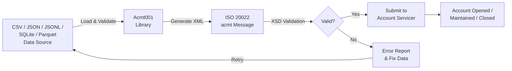
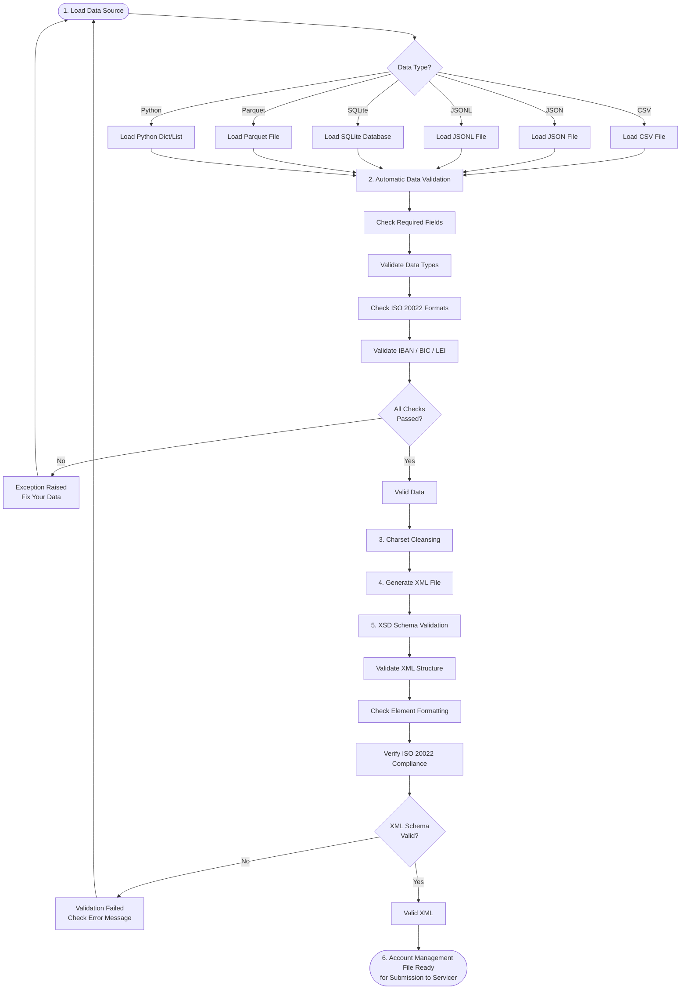
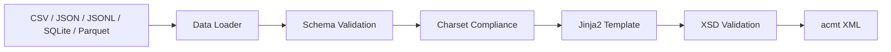

# Acmt001: Automate ISO 20022-Compliant Account Management File Creation

![Acmt001 banner][banner]

## Enterprise-Grade ISO 20022 Account Management Message Generation

[![PyPI Version][pypi-badge]][03]
[![Python Versions][python-versions-badge]][03]
[![PyPI Downloads][pypi-downloads-badge]][07]
[![Licence][licence-badge]][01]
[![Codecov][codecov-badge]][06]
[![Tests][tests-badge]][tests-url]
[![Quality][quality-badge]][quality-url]
[![Documentation][docs-badge]][docs-url]

> **Latest Release: v0.0.1** - Account opening, maintenance, closing, identification, and account switching XML generation, IBAN/BIC/LEI validation, FastAPI REST API, and 34 ISO 20022 acmt message types.
> [See what's new →][release-001]

## Overview

**Acmt001** is an open-source Python library that you can use to create **ISO
20022-compliant acmt Account Management XML messages** — to programmatically
**open, maintain, and close bank accounts** between financial institutions and
large corporates — from your **CSV files**, **JSON files**, **JSONL files**,
**SQLite databases**, or **Apache Parquet files**.

- **Website:** <https://acmt001.com>
- **Source code:** <https://github.com/sebastienrousseau/acmt001>
- **Bug reports:** <https://github.com/sebastienrousseau/acmt001/issues>

The library focuses specifically on **Account Management Messages**, commonly
known as **acmt**. In a simplified way, the acmt family carries the
instructions, confirmations, and reports that govern the **lifecycle of a bank
account** — from the initial opening instruction through detail confirmations,
modifications, mandate maintenance, and final closure — exchanged between
account servicers and account owners.

This is the messaging backbone of modern **Banking-as-a-Service (BaaS)** and
**embedded finance**. Platforms that manage thousands of **virtual accounts**
and **underlying ledger accounts** on behalf of their customers rely on
standardised acmt messaging to instruct their sponsor banks to open new
accounts, amend account details, maintain signatory mandates, and close
accounts at scale — without bespoke, brittle per-bank integrations. **Acmt001**
turns that account lifecycle into validated, auditable, machine-generated ISO
20022 files.

**Key Features:**

- **Mandatory Data Validation:** Ensures all account management files are
  ISO 20022-compliant before creation
- **Multi-source Support:** Works with CSV, JSON, JSONL, SQLite, and
  Parquet data sources
- **Automatic XSD Validation:** Validates generated XML against
  ISO 20022 schemas
- **Comprehensive Testing:** 1,400+ tests with high branch coverage
  ensuring reliability
- **Secure by Design:** Uses `defusedxml` to prevent XXE attacks
  and implements path traversal protection
- **Type-Safe:** Full type hints for better IDE support and type
  checking with mypy (strict mode)
- **Identity Compliance:** IBAN, BIC, and LEI validation, charset
  cleansing, and field length enforcement
- **34 ISO 20022 Message Types Supported:** Covers the full account
  lifecycle — opening, confirmation, modification, status reporting,
  servicing, mandate maintenance, mandate amendment, closing,
  identification, and account switching
- **Production-Ready:** Designed for BaaS platforms, embedded-finance
  providers, and corporate treasuries managing accounts at scale

As of today, the library covers the full **account management lifecycle**:

- **Account Opening (acmt.001 / acmt.007 / acmt.008 / acmt.009):** Instruct,
  request, amend, and supplement the opening of an account at a servicing
  institution
- **Confirmation & Modification (acmt.002 / acmt.003):** Confirm account
  details and instruct changes to an existing account
- **Status Reporting (acmt.005 / acmt.006):** Request and deliver the status
  of an account management request
- **Servicing (acmt.010 – acmt.014):** Acknowledge, reject, supplement,
  request, and report on account management instructions
- **Mandate Maintenance (acmt.015 / acmt.017):** Maintain account mandates,
  including excluded mandates and signatory arrangements
- **Mandate Amendment (acmt.016 / acmt.018):** Amend in-flight mandate
  maintenance requests, including excluded mandates
- **Account Closing (acmt.019 / acmt.020 / acmt.021):** Request, amend, and
  supplement the closure of an account
- **Identification (acmt.022 / acmt.023 / acmt.024):** Advise identification
  changes and request and report on identification verification
- **Account Switching (acmt.027 – acmt.037):** Drive the full account-switch
  lifecycle — information request and response, payment cancellation,
  redirection, balance transfer and acknowledgement, completion notification,
  payment request and response, switch termination, and technical rejection

### Message Lifecycle Overview

| Group | Message type | Name | Key Features |
|-------|--------------|------|--------------|
| Opening | acmt.001.001.08 | Account Opening Instruction | Instruct a servicer to open an account |
| Opening | acmt.007.001.05 | Account Opening Request | Request a new account be opened |
| Opening | acmt.008.001.05 | Account Opening Amendment Request | Amend an in-flight opening request |
| Opening | acmt.009.001.04 | Account Opening Additional Information Request | Supply additional opening information |
| Confirmation | acmt.002.001.08 | Account Details Confirmation | Confirm the agreed account details |
| Modification | acmt.003.001.08 | Account Modification Instruction | Instruct changes to an existing account |
| Status | acmt.005.001.06 | Request For Account Management Status Report | Request the status of a request |
| Status | acmt.006.001.07 | Account Management Status Report | Report the status of a request |
| Servicing | acmt.010.001.04 | Account Request Acknowledgement | Acknowledge receipt of a request |
| Servicing | acmt.011.001.04 | Account Request Rejection | Reject a request with reason codes |
| Servicing | acmt.012.001.04 | Account Additional Information Request | Request more information |
| Servicing | acmt.013.001.04 | Account Report Request | Request an account report |
| Servicing | acmt.014.001.05 | Account Report | Deliver an account report |
| Mandate | acmt.015.001.05 | Account Excluded Mandate Maintenance Request | Maintain excluded mandates |
| Mandate | acmt.016.001.05 | Account Excluded Mandate Maintenance Amendment Request | Amend an in-flight excluded mandate request |
| Mandate | acmt.017.001.05 | Account Mandate Maintenance Request | Maintain account mandates |
| Mandate | acmt.018.001.05 | Account Mandate Maintenance Amendment Request | Amend an in-flight mandate request |
| Closing | acmt.019.001.04 | Account Closing Request | Request closure of an account |
| Closing | acmt.020.001.04 | Account Closing Amendment Request | Amend an in-flight closing request |
| Closing | acmt.021.001.04 | Account Closing Additional Information Request | Supply additional closing information |
| Identification | acmt.022.001.04 | Identification Modification Advice | Advise an identification change |
| Identification | acmt.023.001.04 | Identification Verification Request | Request identification verification |
| Identification | acmt.024.001.04 | Identification Verification Report | Report identification verification results |
| Switching | acmt.027.001.06 | Account Switch Information Request | Request account switch information |
| Switching | acmt.028.001.06 | Account Switch Information Response | Respond with account switch information |
| Switching | acmt.029.001.06 | Account Switch Cancel Existing Payment | Cancel an existing payment arrangement |
| Switching | acmt.030.001.04 | Account Switch Request Redirection | Request redirection of payments |
| Switching | acmt.031.001.06 | Account Switch Request Balance Transfer | Request transfer of the account balance |
| Switching | acmt.032.001.06 | Account Switch Balance Transfer Acknowledgement | Acknowledge the balance transfer |
| Switching | acmt.033.001.02 | Account Switch Notify Account Switch Complete | Notify that the switch is complete |
| Switching | acmt.034.001.06 | Account Switch Request Payment | Request a payment as part of the switch |
| Switching | acmt.035.001.02 | Account Switch Payment Response | Respond to a switch payment request |
| Switching | acmt.036.001.01 | Account Switch Termination Switch | Terminate an account switch |
| Switching | acmt.037.001.02 | Account Switch Technical Rejection | Reject a switch message for technical reasons |

The account lifecycle typically begins with an **account opening request
(acmt.007)** or **opening instruction (acmt.001)**. An account owner — often a
BaaS platform or corporate — sends it to an account servicer (the bank). The
servicer acknowledges, confirms the agreed details (acmt.002), and the account
is opened. Over its life the account is modified (acmt.003), its mandates are
maintained (acmt.017), its status is reported (acmt.006), and eventually it is
closed (acmt.019). Each step is a standardised ISO 20022 message.

The **Acmt001** library reduces the complexity and cost of account lifecycle
processing by generating ISO 20022-compliant account management files with
**mandatory validation**. These files are automatically validated before
creation, eliminating the need to assemble and check them manually. This makes
account onboarding, maintenance, and offboarding more efficient and
cost-effective whilst saving time and resources and minimising the risk of
errors, ensuring accurate and seamless account management.

**Use the Acmt001 library to simplify, accelerate, and automate your account
opening, maintenance, and closing with confidence that every file is ISO
20022-compliant.**

## How It Works

### Account Management Processing Flow



## Table of Contents

- [Acmt001: Automate ISO 20022-Compliant Account Management File Creation](#acmt001-automate-iso-20022-compliant-account-management-file-creation)
  - [Overview](#overview)
  - [Table of Contents](#table-of-contents)
  - [Features](#features)
  - [Requirements](#requirements)
  - [Installation](#installation)
    - [Install `virtualenv`](#install-virtualenv)
    - [Create a Virtual Environment](#create-a-virtual-environment)
    - [Activate environment](#activate-environment)
    - [Getting Started](#getting-started)
  - [Quick Start](#quick-start)
    - [Arguments](#arguments)
  - [Input Data Format](#input-data-format)
    - [Required Fields](#required-fields)
    - [Optional Fields](#optional-fields)
  - [Examples](#examples)
    - [Using a CSV Data File as the source](#using-a-csv-data-file-as-the-source)
    - [Using a JSON Data File as the source](#using-a-json-data-file-as-the-source)
    - [Using a JSONL Data File as the source](#using-a-jsonl-data-file-as-the-source)
    - [Using a SQLite Data File as the source](#using-a-sqlite-data-file-as-the-source)
    - [Using a Parquet Data File as the source](#using-a-parquet-data-file-as-the-source)
    - [Using Python Data Structures (Programmatic API)](#using-python-data-structures-programmatic-api)
    - [Using the Source code](#using-the-source-code)
      - [Account Opening Instruction (acmt.001.001.08)](#account-opening-instruction-acmt00100108)
      - [Account Details Confirmation (acmt.002.001.08)](#account-details-confirmation-acmt00200108)
      - [Account Modification Instruction (acmt.003.001.08)](#account-modification-instruction-acmt00300108)
      - [Account Opening Request (acmt.007.001.05)](#account-opening-request-acmt00700105)
      - [Account Mandate Maintenance Request (acmt.017.001.05)](#account-mandate-maintenance-request-acmt01700105)
      - [Account Closing Request (acmt.019.001.04)](#account-closing-request-acmt01900104)
      - [Identification Verification Request (acmt.023.001.04)](#identification-verification-request-acmt02300104)
  - [REST API (FastAPI)](#rest-api-fastapi)
  - [Compliance & Cleansing](#compliance--cleansing)
  - [Validation](#validation)
  - [Output Files](#output-files)
  - [Architecture](#architecture)
  - [Development](#development)
  - [Troubleshooting](#troubleshooting)
  - [Documentation](#documentation)
  - [Licence](#licence)
  - [Contribution](#contribution)
  - [Acknowledgements](#acknowledgements)

## Features

### Core Functionality

- **Easy to Use:** Both developers and non-developers can easily use the library, as it requires minimal coding knowledge
- **Open Source:** The library is open source and free to use, making it accessible to everyone
- **Mandatory Data Validation:** Ensures account file integrity and ISO 20022 compliance
  - All data sources (CSV, JSON, JSONL, SQLite, Parquet) are automatically validated
  - Invalid data raises clear, actionable error messages indicating what needs to be fixed
  - Validates required fields, data types, and field formats
  - Prevents creation of non-compliant account management files
  - No manual validation needed—it's built into every data load operation

### Security & Quality

- **Secure:** The library prioritises security with multiple layers of protection
  - Uses `defusedxml` for secure XML parsing to prevent XXE attacks
  - Implements path traversal protection in file operations
  - Regular security audits with Bandit
  - All dependencies kept up to date to address known vulnerabilities
  - No sensitive data storage—all information remains confidential
  - OWASP Top 10 security best practices implemented
- **Identity & Charset Compliance:**
  - IBAN, BIC, and LEI validation with checksum verification
  - Charset validation and transliteration for safe characters
  - Automatic field length enforcement (msg_id max 35, names max 140)
  - Full compliance report generation for audit trails
- **Robust Development:** Comprehensive quality assurance with
  - 1,400+ tests with high branch coverage across Python 3.9–3.12
  - Code formatting with Black and Ruff
  - Static type checking with mypy (strict mode)
  - Security scanning with Bandit
  - Performance benchmarks for XML generation

### Business Benefits

- **Customisable:** The library allows developers to customise the output, making it adaptable to specific business requirements and preferences
- **Scalable Solution:** The **Acmt001** library can handle varying volumes of account management files, making it suitable for BaaS platforms and institutions managing anywhere from a handful to thousands of underlying accounts
- **Time-Saving:** The automated file creation process reduces the time spent on manual data entry and file generation, increasing overall productivity
- **Seamless Integration:** As a Python package, the Acmt001 library is compatible with various Python-based applications and easily integrates into any existing projects or workflows
- **Embedded-Finance Ready:** Built for the virtual-account and embedded-finance model, where platforms instruct sponsor banks to manage accounts on their customers' behalf
- **Improved Accuracy:** By providing precise data validation, the library reduces errors in account file creation and processing
- **Enhanced Efficiency:** Automates the creation of account management message files
- **Accelerated Onboarding:** Automates the process and reduces the time required to open, maintain, and close accounts
- **Guaranteed Compliance:** Validates all account files to meet the ISO 20022 standards
- **Simplified Workflow:** Provides a standardised file format for ISO 20022-compliant account management messages
- **Reduced Costs:** Removes manual data entry and file generation, reducing account processing time and errors

## Requirements

**Acmt001** works with macOS, Linux, and Windows and requires:

- **Python 3.9.2 or higher**
- **pip** (Python package installer)

### Key Dependencies

| Package | Purpose |
|---------|---------|
| `click` | Command-line interface creation |
| `defusedxml` | Secure XML parsing (protection against XXE attacks) |
| `xmlschema` | XML Schema validation |
| `rich` | Terminal output formatting |
| `jinja2` | XML template rendering |

All dependencies are automatically installed when you install Acmt001.

## Installation

We recommend creating a virtual environment to install **Acmt001**. This will
ensure that the package is installed in an isolated environment and will not
affect other projects. To install **Acmt001** in a virtual environment, follow
these steps:

### Install `virtualenv`

```sh
python -m pip install virtualenv
```

### Create a Virtual Environment

```sh
python -m venv venv
```

| Code  | Explanation                     |
| ----- | ------------------------------- |
| `-m`  | executes module `venv`          |
| `env` | name of the virtual environment |

### Activate environment

**On macOS/Linux:**
```sh
source venv/bin/activate
```

**On Windows:**
```cmd
venv\Scripts\activate
```

You'll see `(venv)` appear at the start of your command line prompt, indicating the virtual environment is active.

### Getting Started

It takes just a few seconds to get up and running with **Acmt001**. You can
install Acmt001 from PyPI with pip or your favourite package manager.

**Step 1:** Open your terminal and run the following command to install the latest version:

```sh
python -m pip install acmt001
```

**Step 2:** Verify the installation:

```sh
python -c "from acmt001 import generate_xml_string; print('Acmt001 is installed and ready to use')"
```

You should see a confirmation message indicating Acmt001 is ready to use.

**Updating Acmt001:**

If `acmt001` is already installed and you want to upgrade to the latest version:

```sh
python -m pip install -U acmt001
```

## Quick Start

After installation, you can run **Acmt001** directly from the command line. Follow these simple steps:

**Step 1:** Prepare your files

You'll need:
- **XML template file** - Contains the structure for your account management message
- **XSD schema file** - Used to validate the generated XML file
- **Data source** - Your account instructions from:
  - CSV file (.csv)
  - JSON file (.json)
  - JSONL file (.jsonl)
  - SQLite database (.db)
  - Parquet file (.parquet)
  - Python list of dictionaries
  - Python dictionary (single account)

**Step 2:** Run Acmt001

```sh
acmt001 -t <xml_message_type> \
    -m <xml_template_file_path> \
    -s <xsd_schema_file_path> \
    -d <data_file_path>
```

**Real Example:**

```sh
acmt001 -t acmt.007.001.05 \
    -m acmt001/templates/acmt.007.001.05/template.xml \
    -s acmt001/templates/acmt.007.001.05/acmt.007.001.05.xsd \
    -d accounts.csv
```

**Step 3:** Check the output

If successful, you'll see:
- Validation messages in your terminal
- A new ISO 20022-compliant XML file at your specified location

### Safe Validation (Dry-Run Mode)

You can validate your data against the ISO 20022 schema **without
generating an output file** using the `--dry-run` flag. This is ideal for:

- **CI/CD Pipelines:** Pre-flight validation in automated builds
- **Data Quality Checks:** Verify account data before batch processing
- **Template Development:** Test XML templates and schemas without file clutter
- **Pre-Commit Hooks:** Validate data before committing to version control

**Command:**

```sh
acmt001 -t acmt.007.001.05 \
    -m acmt001/templates/acmt.007.001.05/template.xml \
    -s acmt001/templates/acmt.007.001.05/acmt.007.001.05.xsd \
    -d accounts.csv \
    --dry-run
```

**Output:**

```plaintext
All validations passed (--dry-run: no XML generated)
```

**Exit Codes:**

- `0` - Validation succeeded (safe to proceed)
- `1` - Validation failed (data or schema errors detected)

### Arguments

When running **Acmt001**, you will need to specify four arguments:

- An `xml_message_type` (`-t` / `--xml-message-type`): This is the type of XML
  message you want to generate.

  The currently supported types are:

  - acmt.001.001.08
  - acmt.002.001.08
  - acmt.003.001.08
  - acmt.005.001.06
  - acmt.006.001.07
  - acmt.007.001.05
  - acmt.008.001.05
  - acmt.009.001.04
  - acmt.010.001.04
  - acmt.011.001.04
  - acmt.012.001.04
  - acmt.013.001.04
  - acmt.014.001.05
  - acmt.015.001.05
  - acmt.017.001.05
  - acmt.019.001.04
  - acmt.020.001.04
  - acmt.021.001.04
  - acmt.022.001.04
  - acmt.023.001.04
  - acmt.024.001.04

- An `xml_template_file_path` (`-m` / `--template`): This is the path to the XML
  template file you are using that contains variables that will be replaced by
  the values in your data file.

- An `xsd_schema_file_path` (`-s` / `--schema`): This is the path to the XSD
  schema file you are using to validate the generated XML file.

- A `data_file_path` (`-d` / `--data`): This is the path to the CSV, JSON,
  JSONL, SQLite, or Parquet data file you want to convert to XML format.

Additional options:

| Option | Description |
|--------|-------------|
| `-c` / `--config` | Path to an optional configuration file |
| `-o` / `--output-dir` | Directory where the generated XML file is written |
| `--dry-run` / `--validate-only` | Validate only; do not generate an output file |
| `-v` / `--verbose` | Enable detailed output |
| `-h` / `--help` | Show help and exit |

## Input Data Format

Before using **Acmt001**, prepare your data file with the account data. The data
file must include specific fields that map to ISO 20022 acmt elements. Each
record describes one account and the parties associated with it.

### Required Fields

| Field | Description | Example |
|-------|-------------|---------|
| `msg_id` | Message identifier (max 35) | `ACMT-MSG-0001` |
| `creation_date_time` | ISO 8601 datetime | `2026-01-15T10:30:00` |
| `process_id` | Account management process identifier | `ACMT-PRC-0001` |
| `account_id` | Account identifier (IBAN or other) | `GB29NWBK60161331926819` |
| `account_currency` | ISO 4217 currency code | `EUR` |
| `account_name` | Account name (max 140) | `Treasury Operating Account` |
| `account_type_cd` | ISO 20022 account type code | `CACC` |
| `account_servicer_bic` | Account servicer BIC (8 or 11 chars) | `NWBKGB2LXXX` |
| `account_owner_name` | Account owner name (max 140) | `Acme Embedded Finance Ltd` |
| `account_owner_country` | ISO 3166 country code | `GB` |
| `org_full_legal_name` | Organisation legal name (max 140) | `Acme Embedded Finance Limited` |
| `org_id_lei` | Organisation Legal Entity Identifier (20 chars) | `5493001KJTIIGC8Y1R12` |

### Optional Fields

Depending on the message type, the following optional fields enrich the
generated message (account identification, mandate maintenance, status
reporting, and identification verification):

| Field | Description |
|-------|-------------|
| `account_id_other` | Alternative / virtual account identifier |
| `account_owner_lei` | Account owner LEI |
| `org_country_of_operation` | Country of operation |
| `org_address_country` / `org_address_town` | Organisation postal address |
| `org_id_other` | Alternative organisation identifier |
| `status_cd` / `reason_cd` | Status and reason codes (status reports / rejections) |
| `additional_info` | Free-text additional information |
| `assigner_name` / `assignee_name` | Party assigning / assigned the request |
| `verification_id` / `verification_indicator` | Identification verification |
| `original_id` / `party_name` | Identification modification advice |
| `request_to_be_completed_id` / `request_reason` | Additional information requests |
| `mandate_id` / `mandate_channel` | Mandate maintenance |
| `required_signature_number` / `signature_order_indicator` | Signatory arrangements |

**Sample CSV File:**

```csv
msg_id,creation_date_time,process_id,account_id,account_currency,account_name,account_type_cd,account_servicer_bic,account_owner_name,account_owner_country,org_full_legal_name,org_id_lei
ACMT-MSG-0001,2026-01-15T10:30:00,ACMT-PRC-0001,GB29NWBK60161331926819,EUR,Treasury Operating Account,CACC,NWBKGB2LXXX,Acme Embedded Finance Ltd,GB,Acme Embedded Finance Limited,5493001KJTIIGC8Y1R12
```

**Finding Template Files:**

Template files for each supported acmt message type are available in the `acmt001/templates/` directory:

```sh
# If you installed via pip, find the templates with:
python -c "import acmt001; import os; print(os.path.dirname(acmt001.__file__))"

# Navigate to the templates directory:
cd <path_from_above>/templates/
```

Each template directory contains:
- `template.xml` - XML template file
- `acmt.XXX.001.XX.xsd` - XSD schema file for validation

## Examples

The following examples demonstrate how to use **Acmt001** to generate account
management messages from different data sources.

### Using a CSV Data File as the source

```sh
acmt001 -t acmt.007.001.05 \
    -m acmt001/templates/acmt.007.001.05/template.xml \
    -s acmt001/templates/acmt.007.001.05/acmt.007.001.05.xsd \
    -d /path/to/your/accounts.csv
```

### Using a JSON Data File as the source

```sh
acmt001 -t acmt.007.001.05 \
    -m acmt001/templates/acmt.007.001.05/template.xml \
    -s acmt001/templates/acmt.007.001.05/acmt.007.001.05.xsd \
    -d /path/to/your/accounts.json
```

### Using a JSONL Data File as the source

```sh
acmt001 -t acmt.007.001.05 \
    -m acmt001/templates/acmt.007.001.05/template.xml \
    -s acmt001/templates/acmt.007.001.05/acmt.007.001.05.xsd \
    -d /path/to/your/accounts.jsonl
```

### Using a SQLite Data File as the source

```sh
acmt001 -t acmt.007.001.05 \
    -m acmt001/templates/acmt.007.001.05/template.xml \
    -s acmt001/templates/acmt.007.001.05/acmt.007.001.05.xsd \
    -d /path/to/your/accounts.db
```

The default SQLite table name is `acmt001`.

### Using a Parquet Data File as the source

```sh
acmt001 -t acmt.007.001.05 \
    -m acmt001/templates/acmt.007.001.05/template.xml \
    -s acmt001/templates/acmt.007.001.05/acmt.007.001.05.xsd \
    -d /path/to/your/accounts.parquet
```

### Using Python Data Structures (Programmatic API)

You can use the library directly in Python with lists or dictionaries. The
high-level entry points are `process_files` (writes a `<msg_type>.xml` file)
and `generate_xml_string` (returns the validated XML as a string).

```python
from acmt001 import generate_xml_string

# Using a list of account dictionaries
accounts = [
    {
        "msg_id": "ACMT-MSG-0001",
        "creation_date_time": "2026-01-15T10:30:00",
        "process_id": "ACMT-PRC-0001",
        "account_id": "GB29NWBK60161331926819",
        "account_id_other": "VRTL-0001-0001",
        "account_currency": "EUR",
        "account_name": "Treasury Operating Account",
        "account_type_cd": "CACC",
        "account_servicer_bic": "NWBKGB2LXXX",
        "account_owner_name": "Acme Embedded Finance Ltd",
        "account_owner_country": "GB",
        "account_owner_lei": "5493001KJTIIGC8Y1R12",
        "org_full_legal_name": "Acme Embedded Finance Limited",
        "org_country_of_operation": "GB",
        "org_address_country": "GB",
        "org_address_town": "London",
        "org_id_lei": "5493001KJTIIGC8Y1R12",
    }
]

xml = generate_xml_string(
    accounts,
    "acmt.007.001.05",
    "acmt001/templates/acmt.007.001.05/template.xml",
    "acmt001/templates/acmt.007.001.05/acmt.007.001.05.xsd",
)
```

You can also load and validate account data from any supported source directly:

```python
from acmt001 import process_files
from acmt001.data.loader import load_account_data

# Load and validate records from any supported format
accounts = load_account_data("accounts.csv")

# Generate and write <msg_type>.xml into the current working directory
process_files(
    "acmt.007.001.05",
    "acmt001/templates/acmt.007.001.05/template.xml",
    "acmt001/templates/acmt.007.001.05/acmt.007.001.05.xsd",
    accounts,
)
```

> **Note:** When `process_files` is given a file path as its data source, that
> file must live under the current working directory — path traversal is
> blocked for security.

### Using the Source code

You can clone the source code and run the example code in your
terminal/command-line. To check out the source code, clone the repository from
GitHub:

```sh
git clone https://github.com/sebastienrousseau/acmt001.git
```

Ready-made sample data is provided under `examples/`
(`accounts.csv`, `accounts.json`, `accounts.jsonl`).

#### Account Opening Instruction (acmt.001.001.08)

This will generate an account opening instruction in the format of
acmt.001.001.08.

```sh
acmt001 -t acmt.001.001.08 \
    -m acmt001/templates/acmt.001.001.08/template.xml \
    -s acmt001/templates/acmt.001.001.08/acmt.001.001.08.xsd \
    -d examples/accounts.json
```

#### Account Details Confirmation (acmt.002.001.08)

This will generate an account details confirmation in the format of
acmt.002.001.08.

```sh
acmt001 -t acmt.002.001.08 \
    -m acmt001/templates/acmt.002.001.08/template.xml \
    -s acmt001/templates/acmt.002.001.08/acmt.002.001.08.xsd \
    -d examples/accounts.json
```

#### Account Modification Instruction (acmt.003.001.08)

This will generate an account modification instruction in the format of
acmt.003.001.08.

```sh
acmt001 -t acmt.003.001.08 \
    -m acmt001/templates/acmt.003.001.08/template.xml \
    -s acmt001/templates/acmt.003.001.08/acmt.003.001.08.xsd \
    -d examples/accounts.json
```

#### Account Opening Request (acmt.007.001.05)

This will generate an account opening request in the format of acmt.007.001.05.

```sh
acmt001 -t acmt.007.001.05 \
    -m acmt001/templates/acmt.007.001.05/template.xml \
    -s acmt001/templates/acmt.007.001.05/acmt.007.001.05.xsd \
    -d examples/accounts.json
```

#### Account Mandate Maintenance Request (acmt.017.001.05)

This will generate an account mandate maintenance request in the format of
acmt.017.001.05, with signatory mandate support.

```sh
acmt001 -t acmt.017.001.05 \
    -m acmt001/templates/acmt.017.001.05/template.xml \
    -s acmt001/templates/acmt.017.001.05/acmt.017.001.05.xsd \
    -d examples/accounts.json
```

#### Account Closing Request (acmt.019.001.04)

This will generate an account closing request in the format of acmt.019.001.04.

```sh
acmt001 -t acmt.019.001.04 \
    -m acmt001/templates/acmt.019.001.04/template.xml \
    -s acmt001/templates/acmt.019.001.04/acmt.019.001.04.xsd \
    -d examples/accounts.json
```

#### Identification Verification Request (acmt.023.001.04)

This will generate an identification verification request in the format of
acmt.023.001.04.

```sh
acmt001 -t acmt.023.001.04 \
    -m acmt001/templates/acmt.023.001.04/template.xml \
    -s acmt001/templates/acmt.023.001.04/acmt.023.001.04.xsd \
    -d examples/accounts.json
```

You can do the same with the sample SQLite data file:

```sh
acmt001 -t acmt.007.001.05 \
    -m acmt001/templates/acmt.007.001.05/template.xml \
    -s acmt001/templates/acmt.007.001.05/acmt.007.001.05.xsd \
    -d examples/accounts.db
```

> **Note:** The XML file that **Acmt001** generates will automatically be
> validated against the XSD schema file before the new XML file is saved. If
> the validation fails, **Acmt001** will stop running and display an error
> message in your terminal.

## REST API (FastAPI)

Acmt001 provides a **production-ready REST API** for integration with web
services and microservices architectures — ideal for BaaS platforms that need
to instruct account opening, maintenance, and closing on demand.

### Starting the API Server

```sh
# Install with FastAPI support
pip install acmt001

# Start the development server
uvicorn acmt001.api.app:app --reload --host 0.0.0.0 --port 8000

# Or use production server (gunicorn + uvicorn)
pip install gunicorn
gunicorn --workers 4 --worker-class uvicorn.workers.UvicornWorker \
  --bind 0.0.0.0:8000 acmt001.api.app:app
```

### API Endpoints

| Method | Path | Description |
|--------|------|-------------|
| `GET` | `/api/health` | Health check |
| `POST` | `/api/validate` | Validate account data against a schema |
| `POST` | `/api/generate` | Generate XML synchronously |
| `POST` | `/api/generate/async` | Submit an asynchronous generation job |
| `GET` | `/api/status/{job_id}` | Poll the status of an async job |
| `DELETE` | `/api/jobs/{job_id}` | Cancel / remove a job |
| `GET` | `/api/download/{job_id}` | Download the generated XML |

**Health Check:**

```bash
curl -X GET http://localhost:8000/api/health
```

Response:
```json
{
  "status": "healthy",
  "version": "0.0.1",
  "message": "Acmt001 API is running"
}
```

**Validate Account Data:**

```bash
curl -X POST http://localhost:8000/api/validate \
  -H "Content-Type: application/json" \
  -d '{
    "file_path": "accounts.csv",
    "data_source": "csv",
    "message_type": "acmt.007.001.05"
  }'
```

**Generate XML (Synchronous):**

```bash
curl -X POST http://localhost:8000/api/generate \
  -H "Content-Type: application/json" \
  -d '{
    "file_path": "accounts.csv",
    "data_source": "csv",
    "message_type": "acmt.007.001.05",
    "output_dir": "output",
    "validate_only": false
  }'
```

**Generate XML (Asynchronous):**

```bash
# Submit job
curl -X POST http://localhost:8000/api/generate/async \
  -H "Content-Type: application/json" \
  -d '{
    "file_path": "accounts.csv",
    "data_source": "csv",
    "message_type": "acmt.007.001.05"
  }'
```

**Poll Job Status:**

```bash
curl -X GET http://localhost:8000/api/status/550e8400-e29b-41d4-a716-446655440000
```

**Cancel a Job:**

```bash
curl -X DELETE http://localhost:8000/api/jobs/550e8400-e29b-41d4-a716-446655440000
```

**Download Generated XML:**

```bash
curl -X GET http://localhost:8000/api/download/550e8400-e29b-41d4-a716-446655440000 \
  --output account_opening.xml
```

**Interactive API Documentation:**

Once the server is running, visit `http://localhost:8000/api/docs` for
interactive Swagger UI.

## Compliance & Cleansing

Acmt001 includes a built-in compliance module for charset validation and
transliteration, ensuring your account management messages are not silently
rejected by downstream gateways.

```python
from acmt001.compliance import cleanse_data, validate_swift_charset

raw = [{"account_owner_name": "Müller & Söhne™", "msg_id": "X" * 50}]

# Simple cleanse
clean = cleanse_data(raw)
# clean[0]["account_owner_name"] == "Mueller . Soehne."
# len(clean[0]["msg_id"]) == 35  (truncated)

# Validate a single field against the supported charset
validate_swift_charset("Acme Embedded Finance Ltd")
```

**What Gets Cleansed:**

- Non-supported characters transliterated to closest ASCII equivalents
- Field lengths enforced per ISO 20022 maximums
- Full audit report of all transformations applied

## Validation

**Acmt001** implements **mandatory data validation** to ensure all account
management files are ISO 20022-compliant.

### How Validation Works

**Acmt001** performs validation in two stages:

**Stage 1: Data Validation (Automatic)**

Every time you load data (from CSV, JSON, JSONL, SQLite, Parquet, or Python
objects), **Acmt001** automatically validates:
- All required fields are present
- Data types are correct (strings, numbers)
- Field formats meet ISO 20022 standards
- BIC codes are valid (8 or 11 characters)
- IBANs and LEIs pass checksum validation

**Stage 2: XSD Schema Validation (Automatic)**

After generating the XML file, **Acmt001** validates it against the XSD schema
to ensure:
- XML structure is correct
- All elements are properly formatted
- File is ready for submission to the account servicer

### IBAN, BIC, and LEI Validation

The `acmt001.validation` package exposes standalone helpers and a configurable
`ValidationService` for account identity data:

```python
from acmt001.validation import (
    ValidationService,
    validate_iban,
    validate_bic,
    validate_lei,
)

# Standalone helpers — raise on invalid input
validate_iban("GB29NWBK60161331926819")   # IBAN structure + checksum
validate_bic("NWBKGB2LXXX")                # BIC (8 or 11 chars)
validate_lei("5493001KJTIIGC8Y1R12")       # LEI structure + ISO 17442 checksum

# Service-based validation produces a full report
service = ValidationService()
report = service.validate_records(load_account_data("accounts.csv"))
print(report.summary())
```

### Handling Validation Errors

If validation fails, you'll get a clear error message. Acmt001 raises typed
exceptions from `acmt001.exceptions`
(`AccountValidationError`, `InvalidIBANError`, `InvalidBICError`,
`InvalidLEIError`, `MissingRequiredFieldError`, `XSDValidationError`, …), all
subclasses of `Acmt001Error`:

```python
from acmt001 import generate_xml_string
from acmt001.exceptions import Acmt001Error

try:
    xml = generate_xml_string(
        invalid_data,
        "acmt.007.001.05",
        "acmt001/templates/acmt.007.001.05/template.xml",
        "acmt001/templates/acmt.007.001.05/acmt.007.001.05.xsd",
    )
except Acmt001Error as e:
    print(f"Account data validation failed: {e}")
```

### Complete Validation Workflow



## Output Files

When you run **Acmt001**, it generates the following:

1. **XML Account Management File**: A fully compliant ISO 20022 acmt message file
   - Generated in the output directory (defaults to the current working directory)
   - Validated against the XSD schema before being saved
   - Ready for submission to the account servicer

2. **Log Output**: Detailed logging information displayed in your terminal
   - Shows validation progress and any errors
   - Confirms successful file generation

### Output Location

By default the generated XML file is named `<msg_type>.xml` and written to the
current working directory. Use the `-o` / `--output-dir` option to choose a
different destination:

```sh
acmt001 -t acmt.007.001.05 \
    -m acmt001/templates/acmt.007.001.05/template.xml \
    -s acmt001/templates/acmt.007.001.05/acmt.007.001.05.xsd \
    -d accounts.csv \
    -o /output/
```

Will create `/output/acmt.007.001.05.xml`

## Architecture

```
acmt001/
├── api/              # FastAPI REST endpoints, async job manager
├── cli/              # Click CLI for batch processing
├── compliance/       # Charset validation, field length enforcement
├── core/             # Processing pipeline: data → XML
├── csv/              # CSV loader and column validator
├── data/             # Universal data loader with format detection
├── db/               # SQLite loader (standard + streaming)
├── json/             # JSON and JSONL loader
├── parquet/          # Apache Parquet loader
├── schemas/          # 34 JSON schemas for input validation
├── security/         # Path traversal prevention
├── templates/        # 34 Jinja2 templates + XSD schemas
├── validation/       # IBAN, BIC, LEI, and schema validators
└── xml/              # XML generation, XSD validation, file I/O
```

### Data Flow



## Development

### Setting Up Development Environment

Acmt001 uses [Poetry](https://python-poetry.org/) for dependency management and [mise](https://mise.jdx.dev/) for Python version management.

```bash
# Install Python version via mise
mise install

# Clone and install
git clone https://github.com/sebastienrousseau/acmt001.git
cd acmt001
poetry install

# Activate the virtual environment
poetry shell
```

### Development Workflow (Zero-Trust Quality Model)

We enforce a **Zero-Trust Quality Model** with mandatory quality gates. Before submitting a PR, you **must** run the local quality gates to ensure your changes meet our standards.

#### Quality Gates (Makefile)

We use a `Makefile` to orchestrate all quality checks. This ensures consistency between local development and CI/CD pipelines.

```bash
# Run all checks (REQUIRED before commit)
make check

# Run tests with coverage
make test

# Run tests without coverage (fast)
make test-fast

# Run linters (Ruff + Black)
make lint

# Run type checking (mypy)
make type-check

# Cleanup build artifacts
make clean
```

**Quality Gate Requirements:**

| Gate | Command | What It Checks | Exit Code Required |
|------|---------|----------------|--------------------|
| **Tests** | `make test` | pytest with coverage | 0 (PASS) |
| **Lint** | `make lint` | Ruff check, Black format | 0 (PASS) |
| **Types** | `make type-check` | mypy strict mode | 0 (PASS) |
| **Full Gate** | `make check` | All of the above | 0 (PASS) |

**Note:** All PRs must pass the `check` target (exit code 0) and maintain the coverage threshold. No exceptions.

### Manual Quality Tools (Advanced)

If you need to run individual tools:

```bash
# Linting
poetry run ruff check acmt001/

# Formatting
poetry run black acmt001/ tests/

# Type checking
poetry run mypy acmt001/

# Security scanning
poetry run bandit -r acmt001/

# Testing
poetry run pytest tests/ --cov=acmt001 --cov-report=html
```

**However, we strongly recommend using `make check` instead of individual commands to ensure nothing is missed.**

## Troubleshooting

### Common Issues and Solutions

**Issue: "ModuleNotFoundError: No module named 'acmt001'"**

Solution: Ensure you have installed acmt001 and are using the correct Python environment:
```sh
python -m pip install acmt001
# Or if you're using a virtual environment:
source venv/bin/activate
python -m pip install acmt001
```

**Issue: "Error: Invalid XML message type"**

Solution: Ensure you're using one of the 34 supported message types
(acmt.001.001.08, acmt.002.001.08, …, acmt.024.001.04). See the
[Arguments](#arguments) section for the full list.

**Issue: "Error: XML template file does not exist"**

Solution: Verify the file path is correct and the file exists:
```sh
ls -la /path/to/your/template.xml
```

**Issue: "Error: Invalid data"**

Solution: Check that your data file:
- Contains all required fields
- Has valid data in each field
- Uses proper formatting (CSV: commas as delimiters; JSON: valid syntax)
- Has correct BIC codes (8 or 11 characters)
- Has valid IBANs and LEIs (passing checksum validation)

**Issue: "Validation failed"**

Solution: This means the generated XML doesn't match the XSD schema:
- Ensure your data values match ISO 20022 format requirements
- Check that IBANs, BICs, LEIs, and currency codes are valid
- Verify date/time formats are correct (ISO 8601: YYYY-MM-DDTHH:MM:SS)
- Review the error message for specific field issues

**Issue: Permission denied or "Access denied" when reading a data file or writing output**

Solution: File-based data sources must live under the current working directory
(path traversal is blocked for security). Ensure your data file is within the
project directory and that you have write permissions for the output directory:
```sh
chmod u+w /path/to/output/directory
```

### Getting Help

If you encounter issues not covered here:
1. Check the [GitHub Issues](https://github.com/sebastienrousseau/acmt001/issues) for similar problems
2. Review the [Documentation](https://acmt001.com) for detailed guides
3. Create a new issue with:
   - Your Python version (`python --version`)
   - Acmt001 version (`python -m pip show acmt001`)
   - Full error message
   - Minimal example to reproduce the issue

## Documentation

> **Info:** Do check out our [website][00] for comprehensive documentation.

### Supported messages

This section gives access to the documentation related to the ISO 20022 message
definitions supported by **Acmt001**.

#### Account Management

Set of messages used between account owners and account servicers for the
opening, maintenance, closing, identification, and switching of accounts.

| Status | Message type    | Name                                              |
| ------ | --------------- | ------------------------------------------------- |
| ✅      | acmt.001.001.08 | Account Opening Instruction                       |
| ✅      | acmt.002.001.08 | Account Details Confirmation                      |
| ✅      | acmt.003.001.08 | Account Modification Instruction                  |
| ✅      | acmt.005.001.06 | Request For Account Management Status Report      |
| ✅      | acmt.006.001.07 | Account Management Status Report                  |
| ✅      | acmt.007.001.05 | Account Opening Request                           |
| ✅      | acmt.008.001.05 | Account Opening Amendment Request                 |
| ✅      | acmt.009.001.04 | Account Opening Additional Information Request     |
| ✅      | acmt.010.001.04 | Account Request Acknowledgement                   |
| ✅      | acmt.011.001.04 | Account Request Rejection                         |
| ✅      | acmt.012.001.04 | Account Additional Information Request             |
| ✅      | acmt.013.001.04 | Account Report Request                            |
| ✅      | acmt.014.001.05 | Account Report                                    |
| ✅      | acmt.015.001.05 | Account Excluded Mandate Maintenance Request      |
| ✅      | acmt.016.001.05 | Account Excluded Mandate Maintenance Amendment Request |
| ✅      | acmt.017.001.05 | Account Mandate Maintenance Request               |
| ✅      | acmt.018.001.05 | Account Mandate Maintenance Amendment Request     |
| ✅      | acmt.019.001.04 | Account Closing Request                           |
| ✅      | acmt.020.001.04 | Account Closing Amendment Request                 |
| ✅      | acmt.021.001.04 | Account Closing Additional Information Request     |
| ✅      | acmt.022.001.04 | Identification Modification Advice                |
| ✅      | acmt.023.001.04 | Identification Verification Request               |
| ✅      | acmt.024.001.04 | Identification Verification Report                |
| ✅      | acmt.027.001.06 | Account Switch Information Request                 |
| ✅      | acmt.028.001.06 | Account Switch Information Response                |
| ✅      | acmt.029.001.06 | Account Switch Cancel Existing Payment            |
| ✅      | acmt.030.001.04 | Account Switch Request Redirection                |
| ✅      | acmt.031.001.06 | Account Switch Request Balance Transfer           |
| ✅      | acmt.032.001.06 | Account Switch Balance Transfer Acknowledgement   |
| ✅      | acmt.033.001.02 | Account Switch Notify Account Switch Complete     |
| ✅      | acmt.034.001.06 | Account Switch Request Payment                    |
| ✅      | acmt.035.001.02 | Account Switch Payment Response                   |
| ✅      | acmt.036.001.01 | Account Switch Termination Switch                 |
| ✅      | acmt.037.001.02 | Account Switch Technical Rejection                |

## Licence

The project is licensed under the terms of the Apache Licence (Version 2.0).

- [Apache Licence, Version 2.0][01]

## Contribution

We welcome contributions to **Acmt001**. Please see the
[contributing instructions][04] for more information.

Unless you explicitly state otherwise, any contribution intentionally submitted
for inclusion in the work by you, as defined in the Apache-2.0 licence, shall
be licensed as above, without any additional terms or conditions.

## Acknowledgements

We would like to extend a big thank you to all the awesome contributors of
[Acmt001][05] for their help and support.

[00]: https://acmt001.com
[01]: https://opensource.org/license/apache-2-0/
[03]: https://github.com/sebastienrousseau/acmt001
[04]: https://github.com/sebastienrousseau/acmt001/blob/main/CONTRIBUTING.md
[05]: https://github.com/sebastienrousseau/acmt001/graphs/contributors
[06]: https://codecov.io/github/sebastienrousseau/acmt001?branch=main
[07]: https://pypi.org/project/acmt001/
[release-001]: https://github.com/sebastienrousseau/acmt001/releases/tag/v0.0.1

[banner]: https://kura.pro/acmt001/images/banners/banner-acmt001.svg 'Acmt001, A Python Library for Automating ISO 20022 acmt Account Management XML Messages.'
[codecov-badge]: https://img.shields.io/codecov/c/github/sebastienrousseau/acmt001?style=for-the-badge 'Codecov badge'
[docs-badge]: https://img.shields.io/badge/Docs-acmt001.com-blue?style=for-the-badge 'Documentation badge'
[docs-url]: https://acmt001.com/
[licence-badge]: https://img.shields.io/pypi/l/acmt001?style=for-the-badge 'Licence badge'
[pypi-badge]: https://img.shields.io/pypi/v/acmt001?style=for-the-badge 'PyPI version badge'
[pypi-downloads-badge]: https://img.shields.io/pypi/dm/acmt001.svg?style=for-the-badge 'PyPI Downloads badge'
[python-versions-badge]: https://img.shields.io/pypi/pyversions/acmt001.svg?style=for-the-badge 'Python versions badge'
[quality-badge]: https://img.shields.io/github/actions/workflow/status/sebastienrousseau/acmt001/ci.yml?branch=main&label=Quality&style=for-the-badge 'Code quality badge'
[quality-url]: https://github.com/sebastienrousseau/acmt001/actions/workflows/ci.yml
[tests-badge]: https://img.shields.io/github/actions/workflow/status/sebastienrousseau/acmt001/ci.yml?branch=main&label=Tests&style=for-the-badge 'Tests badge'
[tests-url]: https://github.com/sebastienrousseau/acmt001/actions/workflows/ci.yml
